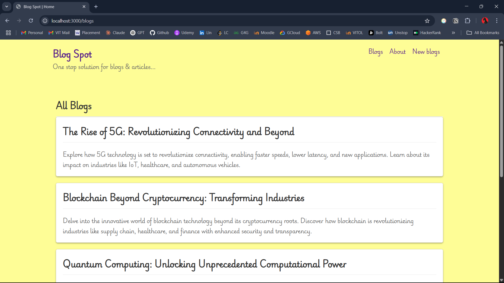
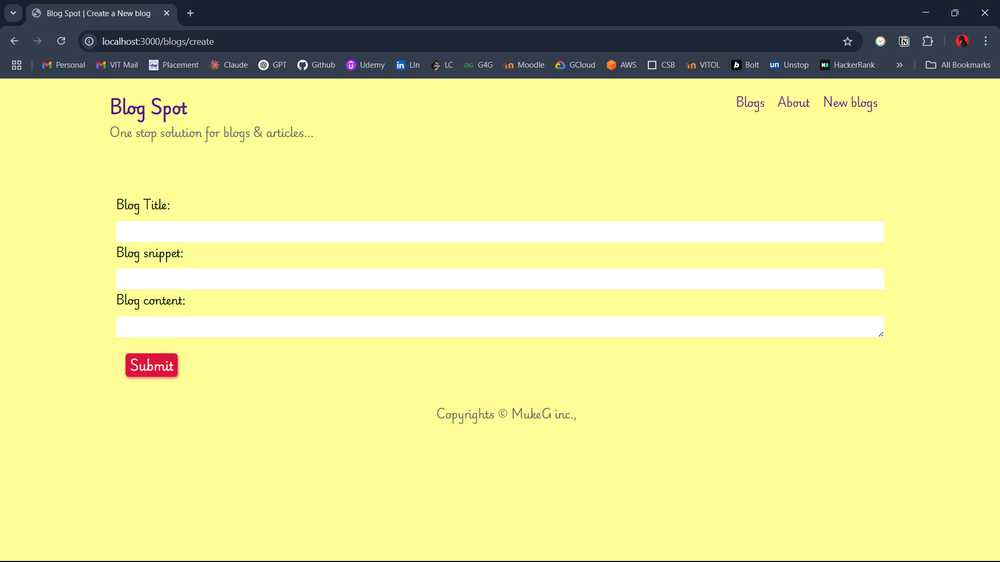
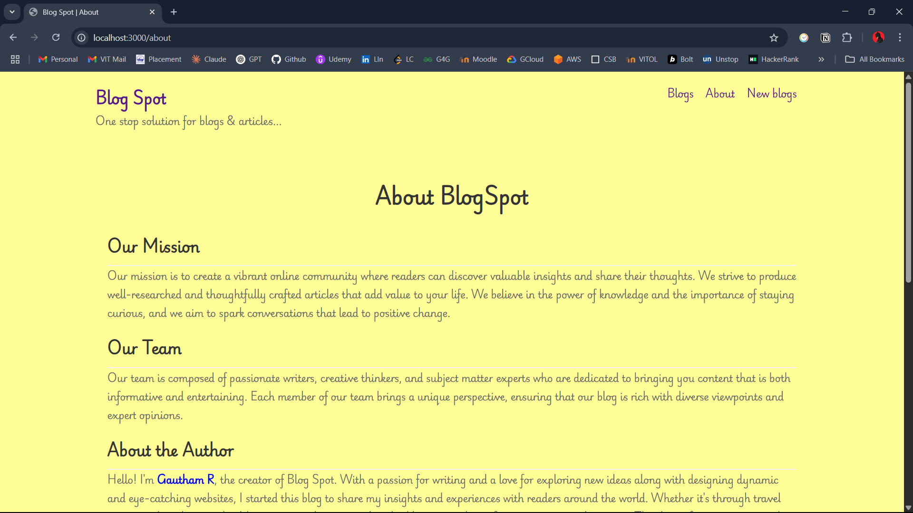

# BlogApp Express

A full-stack blog application built with Express.js and MongoDB, following the MVC (Model-View-Controller) architecture. This application allows users to create, read, update, and delete blog posts with a clean and intuitive interface.

## 🚀 Features

- Create and publish blog posts
- View all blog posts
- Read individual blog posts
- Basic frontend with EJS templating
- MongoDB integration for data persistence
- MVC architecture
- Responsive design

## 🛠 Tech Stack

- **Backend**: Node.js, Express.js
- **Database**: MongoDB
- **View Engine**: EJS
- **Frontend**: HTML, CSS, JavaScript
- **Other Tools**: Mongoose, dotenv

## 📝 Prerequisites

- Node.js (>=18.x)
- MongoDB
- npm or yarn

## 🔧 Installation & Setup

1. Clone the repository
   ```bash
   git clone https://github.com/rgautham7/BlogApp_Express
   cd BlogApp_Express
   ```

2. Install dependencies
   ```bash
   npm install
   ```

3. Create a `.env` file in the root directory and add:
   ```
   MONGODB_KEY=your_mongodb_connection_string
   PORT=3000
   ```

4. Start the application
   ```bash
   npm start
   ```

## 📱 Pages Overview

### Blog Listing Page (`/blogs`)

The main page displays all blog posts with their titles and snippets. Users can click on individual posts to read more.

### Create New Blog (`/new_blog`)

A form page where users can create new blog posts by entering a title, snippet, and the main content.

### About Page (`/about`)

Information about BlogSpot and its mission.

## 🏗 Project Structure

BlogApp_Express/
├── api/                    # API routes for serverless deployment
├── controllers/           # Business logic
├── models/               # Database models
├── public/               # Static files
│   ├── css/             # Stylesheets
│   ├── js/              # Client-side JavaScript
│   └── images/          # Image assets
├── routes/               # Route definitions
├── views/                # EJS templates
│   ├── partials/        # Reusable template parts
│   └── pages/           # Page templates
├── app.js               # Main application file
├── package.json         # Project dependencies
└── README.md            # Project documentation

## 💻 API Endpoints

- `GET /blogs` - Get all blog posts
- `POST /blogs` - Create a new blog post
- `GET /blogs/:id` - Get a specific blog post
- `DELETE /blogs/:id` - Delete a blog post

## 🤝 Contributing

1. Fork the repository
2. Create your feature branch (`git checkout -b feature/AmazingFeature`)
3. Commit your changes (`git commit -m 'Add some AmazingFeature'`)
4. Push to the branch (`git push origin feature/AmazingFeature`)
5. Open a Pull Request

## 📄 License

This project is licensed under the ISC License.

## 📞 Contact

Project Link: [[https://github.com/rgautham7/BlogApp_Express](https://github.com/rgautham7/BlogApp_Express)]
